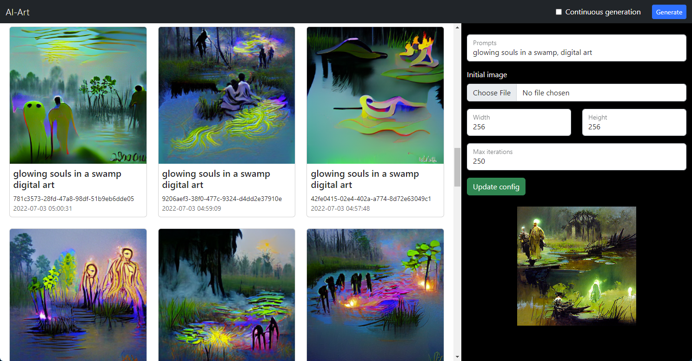

# AI-Art

Art generation using VQGAN + CLIP using docker containers. A simplified,
updated, and expanded upon version of
[Kevin Costa's work](https://github.com/kcosta42/VQGAN-CLIP-Docker). This
project tries to make generating art as easy as possible for anyone with a GPU
by providing a simple web UI.

## Samples

For samples check out the [AI Generated](https://isaacbythewood.com/art) section
on the art page on my website.

## Using ai-art

This works best if you have an NVIDIA GPU however there is a fallback CPU mode
included. I've found the CPU mode to take significantly longer than even the
most basic of GPUs though.

Install [Docker Desktop](https://www.docker.com/products/docker-desktop/) for
your OS.

### Quick start usage

Note that this creates a new directory in your current directory called ai-art
for all output and model storage. Make sure it's where you want it to be.

    docker run -it --rm --gpus all -p 3000:3000 -v ${pwd}/ai-art:/data overshard/ai-art

Once it's running you can access AI-Art in your browser at:

    http://localhost:3000/

### Development usage

Get the latest version of this project from GitHub:

    git clone https://github.com/overshard/ai-art.git

Then run it with:

    docker build --tag overshard/ai-art .
    docker run -it --rm --gpus all -p 3000:3000 -v ${pwd}/data:/data overshard/ai-art

If you are using a docker container on Windows to develop this project like I am
then you can use something like this to mount a directory on the host system
from your development container:

    docker run -it --rm --gpus all -p 3000:3000 -v "/C/Users/Isaac Bythewood/Documents/AI-Art:/data" overshard/ai-art

## Image sizes

The larger the image the more VRAM your graphics card needs:

- 6 GB of VRAM is required to generate 256x256 images.
- 12 GB of VRAM is required to generate 512x512 images.
- 24 GB of VRAM is required to generate 1024x1024 images.

If you don't know how much VRAM your graphics card has you probably have 6 GB
or less so stick with smaller images.

That being said you can do non-square images if you want as long as you don't
go above the number of pixels your GPU's VRAM supports, for example you could
do ultrawide images with 6 GB of ram at "384x128" or do tall images at "128x384"
and so on. You do not have to use numbers with a power of 2, "300x100" is also
perfectly valid.
